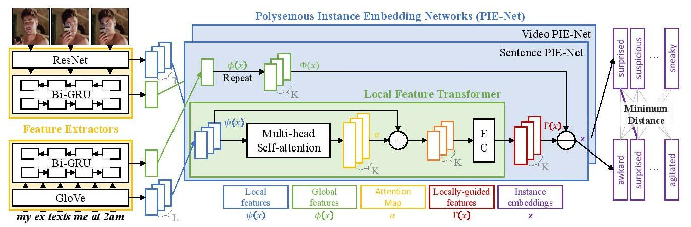

# Polysemous Visual-Semantic Embedding (PVSE)

This repository contains a PyTorch implementation of the PVSE network and the MRW dataset proposed in our paper [*Polysemous Visual-Semantic Embedding for Cross-Modal Retrieval* (CVPR 2019)](https://arxiv.org/abs/1906.04402). The code and data are free to use for *academic purposes only*. 

Please also visit our [project page](https://yalesong.github.io/pvse/)




### Table of contents
1. [MRW Dataset](#mrw-dataset)
2. [Setting up an environment](#setting-up-an-environment)
3. [Download and prepare data](#download-and-prepare-data)
4. [Evaluate pretrained models](#evaluate-pretrained-models)
5. [Train your own model](#train-your-own-model)


## MRW Dataset

Our *My Reaction When (MRW)* dataset contains `50,107` video-sentence pairs crawled from social media, where videos display physical or emotional reactions to the situations described in sentences. This subreddit [/r/reactiongifs](https://www.reddit.com/r/reactiongifs/) contains several examples; below shows some representative examples pairs; 

| (a) Physical Reaction | (b) Emotional Reaction | (c) Animal Reaction | (d) Lexical Reaction |
| :-------------------: | :--------------------: | :-----------------: | :------------------: |
| MRW a witty comment I wanted to make was already said | MFW I see a cute girl on Facebook change her status to single | MFW I cant remember if I've locked my front door | MRW a family member askes me why his computer isn't working |
|  |  |  |  |

Below shows the descriptive statistics of the datset. The word vocabulary size is `34,835`. The dataset can be used for evaluting cross-modal retrieval systems under *ambiguous/weak-association* between vision and language.

|        | Train  | Validation |  Test |  Total |
| :---:  | :----: | :--------: | :---: |  :---: |
| #pairs | 44,107 |      1,000 | 5,000 | 50,107 |
| Avg. #frames | 104.91 | 209.04 | 209.55 | 117.43 |
| Avg. #words  | 11.36 |  15.02 |  14.79 | 11.78 |
| Avg. word frequency | 15.48 | 4.80 | 8.57 | 16.94 |

We provide detailed analysis of the dataset in the [supplementary material](https://arxiv.org/abs/1906.04402) of the main paper.

Follow the instruction [below](#mrw) to download the dataset.

## Setting up an environment

We recommend creating a virtual environment and install packages there. Note, you must install the Cython package first.
```
python3 -m venv <your virtual environment name>
source <your virtual environment name>/bin/activate
pip3 install Cython
pip3 install -r requirements.txt
```


## Download and prepare data

### MRW
```
cd data
bash prepare_mrw_dataset.sh
```
This will download the dataset (without videos) in a JSON format, a vocabulary file, and train/val/test splits. It will then prompt an option:
```
Do you wish to download video data and gulp them? [y/n]
```
We provide two ways to obtain the data. A recommended option is to download pre-compiled data in a [GulpIO](https://github.com/TwentyBN/GulpIO) binary storage format, which contains video frames sampled at 8 FPS. For this, simpliy hit `n` (this will terminate the script) and download our pre-compiled GulpIO data in [this link (54 GB)](https://drive.google.com/file/d/14hni_L2iN3_zsZ1KDkh21juWYCE0s13j). After finish downloading, extract the tarball under `data/mrw/gulp` to train and/or test our models.

If you wish to download raw video clips and gulp them on your own, hit `y` once prompted with the message above. This will start downloading videos and, once finished, start gulping the video files at 8 FPS (you can change this in [download_gulp_mrw.py](./data/mrw/download_gulp_mrw.py)). If you encounter any problem downloading the video files, you may also download them directly from [this link (19 GB)](https://drive.google.com/file/d/1Gcv4j-b2TkWLgSNF1Ye5zOa-LTG3mBcL), and then continue gulping them using the script [download_gulp_mrw.py](./data/mrw/download_gulp_mrw.py). 


### TGIF
```
cd data
bash prepare_tgif_dataset.sh
```
This will download the dataset (without videos) in a TSV format, a vocabulary file, and train/val/test splits. Please note, we use a slightly modified version of the [TGIF dataset](https://github.com/raingo/TGIF-Release) because of invalid video files; the script will automatically download the modified version.
 
 
It will then prompt an option:
```
Do you wish to gulp the data? [y/n]
```

Similar to the MRW data, we provide two options to obtain the data: (1) download pre-compiled GulpIO data, or (2) download raw video clips and gulp them on your own, and we recommend the first option for an easy start. For this, simply hit `n` and download our pre-compiled GulpIO data in [this link (89 GB)](https://drive.google.com/file/d/1W2iXV9tWxKkYkTzOCvUMTQBkVPg_8mOf). After finish downloading `tgif-gulp.tar.gz`, extract the tarball under `data/tgif/gulp`.  

If you wish to gulp your own dataset, hit `y` and follow the prompt. Note that you must first download a tarball containing the videos before gulping. You can download the file `tgif.tar.gz` (124 GB) from [this link](https://drive.google.com/open?id=0B15H16jpV4w2NHI2QmUxV21JdkE) and place it under `./data/tgif`. Once you have the video data, the script will start gulping the video files.


### MS-COCO
```
cd data
bash prepare_coco_dataset.sh
```


## Evaluate pretrained models

Download all six pretrained models in a tarball at [this link](https://drive.google.com/file/d/1bj6-LLx-jGMcS6qKiA23wPoSiXC9toIw). You can also download each individual files using the links below.

| Dataset | Model | Command | 
| ------- | ----- | ------- | 
| COCO | PVSE (k=1) [[download]](https://drive.google.com/file/d/1NvHhATydJ94r2O48_m72tx028Jy17Mxl) | `python3 eval.py --data_name coco --num_embeds 1 --img_attention --txt_attention --legacy --ckpt ./ckpt/coco_pvse_k1.pth` | 
| COCO | PVSE [[download]](https://drive.google.com/file/d/1cFePGpvhs4ypu7q2j1dDbgspBbBcD2z7) | `python3 eval.py --data_name coco --num_embeds 2 --img_attention --txt_attention --legacy --ckpt ./ckpt/coco_pvse.pth` | 
| MRW | PVSE (k=1) [[download]](https://drive.google.com/file/d/1gkXfdhupyv10y1pMIsHm9XaanCo2ewUR) | `python3 eval.py --data_name mrw --num_embeds 1 --img_attention --txt_attention --max_video_length 4 --legacy --ckpt ./ckpt/mrw_pvse_k1.pth` | 
| MRW | PVSE [[download]](https://drive.google.com/file/d/1k5VO_7OGfy7k9H4xg5GqtfBTMtNflgH-) | `python3 eval.py --data_name mrw --num_embeds 5 --img_attention --txt_attention --max_video_length 4 --legacy --ckpt ./ckpt/mrw_pvse.pth` | 
| TGIF | PVSE (k=1) [[download]](https://drive.google.com/file/d/1FGDDrszmdzHn7gnLGbZqYlIbA1lTVymk) | `python3 eval.py --data_name tgif --num_embeds 1 --img_attention --txt_attention --max_video_length 8 --legacy --ckpt ./ckpt/tgif_pvse_k1.pth` |
| TGIF | PVSE [[download]](https://drive.google.com/file/d/1BOhePBouPjdrd8o67avn7drWB5h1_YGI) | `python3 eval.py --data_name tgif --num_embeds 3 --img_attention --txt_attention --max_video_length 8 --legacy --ckpt ./ckpt/tgif_pvse.pth` |

Using the pretrained models you should be able to reproduce the results in the table below

| Dataset | Model | Image/Video-to-Text <br> R@1 / R@5 / R@10 / Med r (nMR) | Text-to-Image/Video <br> R@1 / R@5 / R@10 / Med r (nMR) |
| - | - | - | - |
| COCO 1K | PVSE (K=1) | 66.72 / 91.00 / 96.22 / 1 (0.00) | 53.49 / 85.14 / 92.70 / 1 (0.00) |
| COCO 1K | PVSE | 69.24 / 91.62 / 96.64 / 1 (0.00) | 55.21 / 86.50 / 93.73 / 1 (0.00) |
| COCO 5K | PVSE (K=1) | 41.72 / 72.96 / 82.90 / 2 (0.00) | 30.64 / 61.37 / 73.62 / 3 (0.00) |
| COCO 5K | PVSE | 45.18 / 74.28 / 84.46 / 2 (0.00) | 32.42 / 62.97 / 74.96 / 3 (0.00)|
| MRW | PVSE (K=1) | 0.16 / 0.68 / 0.90 / 1700 (0.34) | 0.16 / 0.56 / 0.88 / 1650 (0.33) |
| MRW | PVSE | 0.18 / 0.62 / 1.18 / 1624 (0.32) | 0.20 / 0.70 / 1.16 / 1552 (0.31) |
| TGIF | PVSE (K=1) | 2.82 / 9.07 / 14.02 / 128 (0.01) | 2.63 / 9.37 / 14.58 / 115 (0.01) |
| TGIF | PVSE | 3.28 / 9.87 / 15.56 / 115 (0.01) | 3.01 / 9.70 / 14.85 / 109 (0.01) |


## Train your own model

You can train your own model using [train.py](train.py); check [option.py](option.py) for all available options.

For example, you can train our PVSE model (k=2) on COCO using the command below. It uses ResNet152 as a backbone CNN, GloVe word embedding, MMD loss weight 0.01 and DIV loss weight 0.1, and bacth size of 256: 

```
python3 train.py --data_name coco --cnn_type resnet152 --wemb_type glove --margin 0.1 --max_violation --num_embeds 2 --img_attention --txt_attention --mmd_weight 0.01 --div_weight 0.1 --batch_size 256
```

For video models, you should set the parameter `--max_video_length`; otherwise it defaults to 1 (single frame). Here's an example command:

```
python3 train.py --data_name mrw --max_video_length 4 --cnn_type resnet18 --wemb_type glove --margin 0.1 --num_embeds 4 --img_attention --txt_attention --mmd_weight 0.01 --div_weight 0.1 --batch_size 128
```


---
If you use any of the material in this repository we ask you to cite:
```
@inproceedings{song-pvse-cvpr19,
  author    = {Yale Song and Mohammad Soleymani},
  title     = {Polysemous Visual-Semantic Embedding for Cross-Modal Retrieval},
  booktitle = {CVPR},
  year      = 2019
```

Our code is based on [the implementation by Faghri et al.](https://github.com/fartashf/vsepp)


## Notes
*Last edit: Tuesday July 16, 2019* 
